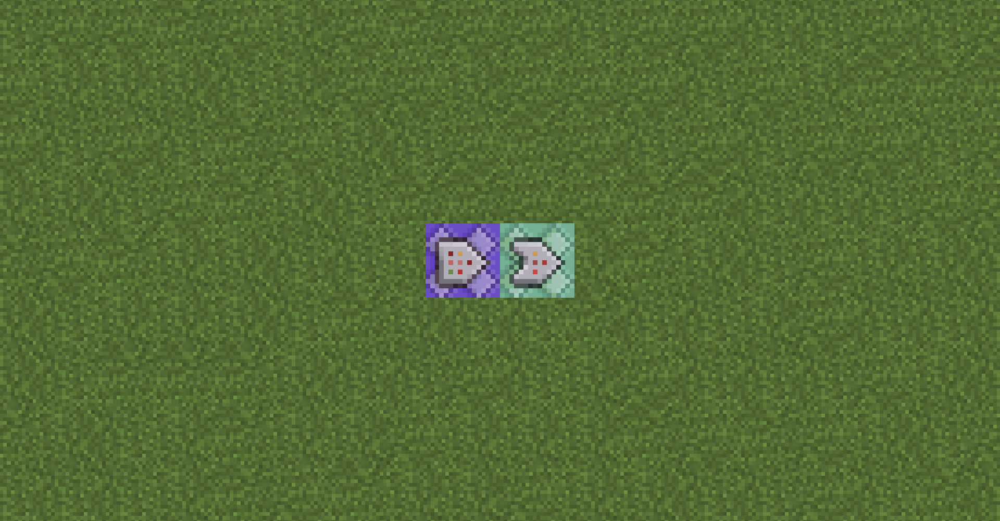

# 1.6 1.13- 和基岩版的命令方块方案

* 本节内容仅提供实现思路与方法参考，与 TPA 数据包文件本身无直接关联  
* 对于 1.9–1.12.2，`/tag` 指令可能需要使用 `/scoreboard players tag` 进行替代  

---

## 双人方案

### 最终效果
双人方案适用于仅有两名玩家联机的场景。  
玩家可直接使用 `/trigger tpa` 传送至对方所在位置。

### 手动输入部分
在放置命令方块之前，请先创建以下记分项。  
（注意：输入每条指令前需加斜杠 “/”）

```
scoreboard objectives add tpa trigger
```

### 命令方块部分
请按顺序设置以下命令方块：

```
scoreboard players enable @a tpa
tp @p[name="<玩家1>",scores={tpa=1..}] <玩家2>
tp @p[name="<玩家2>",scores={tpa=1..}] <玩家1>
scoreboard players set @a tpa 0
```

- 第一行放入 **循环 / 不受制约 / 保持开启** 的命令方块  
- 第二至第四行分别放入 **三个连锁 / 不受制约 / 保持开启** 的命令方块  

其中尖括号 “<>” 及其内容需整体替换为真实的玩家名。

命令方块放置示意如下：  


---

## 多人方案

### 最终效果
多人方案适用于多人联机环境。  
每名玩家进入世界后会被系统分配一个唯一 ID。

如需查看当前玩家 ID，可执行：
- `/scoreboard objectives setdisplay sidebar id`  
- 查看完成后使用 `/scoreboard objectives setdisplay sidebar` 关闭显示  

玩家可通过 `/trigger tpa set <ID>` 传送至对应 ID 的玩家。

### 手动输入部分
在放置命令方块之前，请依次输入以下指令：

```
scoreboard objectives add tpa trigger
scoreboard objectives add id dummy
scoreboard players set #global_current id 0
```

---

### 命令方块部分

#### 1. 分配 ID

请按下图所示方式放置命令方块（建议确保图片方向为“上北下南”）：  


**命令方块 A**：循环 / 不受制约 / 保持开启  
```
execute as @a unless score @s id = @s id run scoreboard players set @s id 0
```

**命令方块 B**：循环 / 不受制约 / 保持开启  
```
execute as @p[scores={id=0}] run scoreboard players add #global_current id 1
```

**命令方块 C、D**：紧接放置，连锁 / 条件制约 / 保持开启  
```
tellraw @a ["[TPA] ", {"selector": "@p[scores={id=0}]"}, " 分配了 ID: ", {"score": {"name": "#global_current", "objective": "id"}}]
scoreboard players operation @p[scores={id=0}] id = #global_current id
```

---

#### 2. 处理传送

传送逻辑提供两种方案：

- **自闭链方案**：  
  实现复杂，但理论上可支持无限玩家  

- **枚举方案**：  
  实现简单，但仅适用于玩家数量有限的情况  

---

##### 自闭链方案

⚠ 本方案对命令方块的空间布局与朝向要求极高。  
错误的放置或修改 **可能导致存档损坏甚至崩溃**，请务必严格按步骤操作。

最终命令方块布局如下（图中混凝土仅作尺寸标尺）：  


在命令方块 A 南侧放置、朝向西的 **命令方块 E**：  
循环 / 不受制约 / **红石控制**

```
scoreboard players enable @a tpa
```

随后沿命令方块 E 向西放置 **F、G、H、I、J、K、L、M₀、N₀**  
均为：连锁 / 不受制约 / 保持开启

```
tp @p[tag=reqer] @p[tag=target]
scoreboard players set @a[tag=reqer] tpa 0
tag @a remove reqer
tag @a remove target
tag @a remove notmatch
scoreboard players set #found tpa 0
tag @p[scores={tpa=1..}] add reqer
tag @p[tag=!notmatch] add target
execute if score @p[tag=target] id = @p[tag=reqer] tpa run scoreboard players set #found tpa 1
```

继续在 N₀ 西侧放置、朝向南的 **命令方块 O₀**：  
连锁 / 不受制约 / 保持开启

```
execute if score #found tpa matches 0 run tag @p[tag=target] add notmatch
```

随后在 O₀ 南侧放置、朝向东的 **命令方块 P₀**：  
连锁 / 不受制约 / 保持开启

```
execute if score #found tpa matches 0 run tag @a remove target
```

继续在 P₀ 东侧放置 **命令方块 Q₀**（无需填写指令），  
再在 Q₀ 东侧放置朝向北的 **命令方块 R₀**：

```
execute if score #found tpa matches 0 if entity @p[tag=!notmatch] run clone ~-2 ~ ~-3 ~ ~ ~-2 ~-2 ~ ~-1
```

最后，玩家站在 **O₀（第一个拐弯处、西北角的命令方块）正中央**，  
在聊天栏输入：

```
clone ~ ~-1 ~ ~2 ~-1 ~1 ~ ~-1 ~-2
```

完成后，身后将生成 **M₁、N₁、O₁、P₁、Q₁、R₁** 六个命令方块。

---

##### 枚举方案

```
scoreboard players enable @a tpa
tp @a[scores={tpa=1}] @p[scores={id=1}]
tp @a[scores={tpa=2}] @p[scores={id=2}]
tp @a[scores={tpa=3}] @p[scores={id=3}]
...
scoreboard players set @a tpa 0
```

枚举方案的逻辑非常直观，只需按上述模式继续补充即可。

- 若命令数量过多，可从末尾开始适当裁剪  
- 若需要支持更多玩家，可继续向下扩展  
- 当玩家数量较多时，仍建议优先使用自闭链方案（尽管配置复杂）

最终命令方块放置示意如下：  
